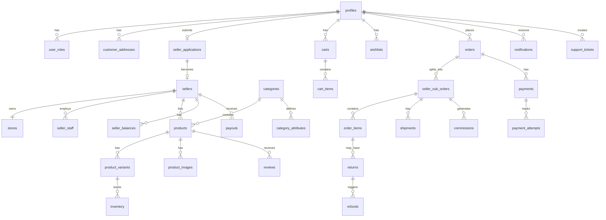

# Database Schema

> Migrations live in `supabase/migrations/`. Apply with `npm run db:push`.

## Migration files

| File | Contents |
|------|----------|
| `20250731000001_extensions_and_enums.sql` | Extensions, enums, `set_updated_at()` |
| `20250731000002_profiles_and_roles.sql` | Profiles, roles, permissions, addresses, auth trigger |
| `20250731000003_catalog.sql` | Categories, sellers, stores, products, variants, reviews |
| `20250731000004_commerce.sql` | Carts, wishlists, orders, audit logs, settings |
| `20250731000005_rls_policies.sql` | RLS helper functions and all policies |
| `20250731000006_seed_categories.sql` | Development category seed |

## Apply migrations

```bash
supabase login
supabase link --project-ref YOUR_PROJECT_REF
npm run db:push
```

Generate TypeScript types:
```bash
npm run db:types
```



## Core tables

| Table | Purpose | Key fields |
|-------|---------|------------|
| `profiles` | User profile extending auth.users | id, email, full_name, avatar_url |
| `user_roles` | Role assignments | user_id, role, seller_id |
| `permissions` | Granular permissions | role, resource, action |
| `customer_addresses` | Delivery addresses | user_id, line1, city, country |
| `seller_applications` | Seller onboarding | user_id, status, documents |
| `sellers` | Approved sellers | user_id, status, commission_rate |
| `stores` | Seller storefronts | seller_id, name, slug, description |
| `categories` | Product taxonomy | name, slug, parent_id |
| `products` | Product catalog | seller_id, category_id, status, price |
| `product_variants` | SKU variants | product_id, sku, price, attributes |
| `inventory` | Stock levels | variant_id, quantity, reserved |
| `carts` / `cart_items` | Shopping carts | user_id/session_id, product_id, quantity |
| `orders` | Parent marketplace orders | user_id, status, total, payment_status |
| `seller_sub_orders` | Per-seller fulfilment | order_id, seller_id, status |
| `order_items` | Line items | sub_order_id, product_id, quantity, price |
| `payments` | Payment records | order_id, amount, status, provider_id |
| `commissions` | Platform commission entries | sub_order_id, rate, amount |
| `payouts` | Seller payouts | seller_id, amount, status |
| `reviews` | Product reviews | product_id, user_id, rating |
| `audit_logs` | Admin action audit trail | actor_id, action, old_value, new_value |

## Conventions

- All tables use UUID primary keys (`gen_random_uuid()`)
- `created_at` and `updated_at` timestamps on all tables
- Soft delete via `deleted_at` where appropriate
- Status fields use enums, not free-text strings
- RLS enabled on all tables
- Indexes on foreign keys and common query patterns

See `supabase/migrations/` for SQL migrations (Milestone 3).
